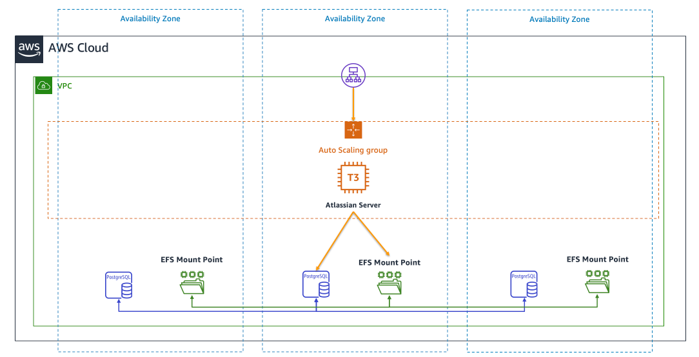

# Atlassian Suite on AWS GovCloud (US)

This example code deploys the Atlassian Suite on to AWS GovCloud (US) (and standard AWS Regions). It provisions a highly available deployment. This repository utilizes the [AWS CDK](https://aws.amazon.com/cdk/) to deploy the infrastructure.

| Product | Status |
|---------|--------|
| BitBucket | Supported |
| Jira | Coming Soon |
| Confluence | Coming Soon |

## Architecture

This architecture leverages the Application Load Balancer, EC2 Autoscaling Groups, RDS PostgreSQL, and Amazon Elastic Filesystem.



## Getting Started

To get started, you will need to install Node.js, NPM, and have the AWS CLI configured with a profile that has access to your target environment. Once you have those dependencies installed, run the following command to install the CDK depdencies.

```bash

# install the stack dependencies
make install

# deploy the stack
make deploy

# destroy the stack
make destroy

```
